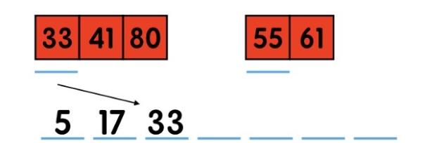
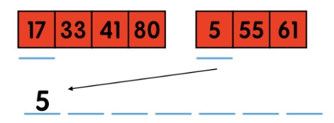

# 11495-Bubbles and Buckets

input有N個數的數列，求排序時(由小到大)共交換幾次，並判斷交換次數的奇偶性。

2 <= N <= 10^5


### solution

這題看似要用氣泡排序法去解，程式碼如下

```c++
void bubblesort(int array[] , int length) {
    for(int i = 0 ; i < length ; i++)
	{
		for(int j = 0 ; i < length - i ; j++)
		{
			if(array[i] > array[j]) swap(array[i] , array[j]) ;
		}
	
	}
}
```

時間複雜度為 O(N^2),這題的N最大為 10^5 一定會超時，所以我們需要用複雜度較小的合併排序法(Merge sort)

### 合併排序法(Merge sort)

典型的divide and conquer Algorithm 也就是把大問題分成小問題再解決。

參考資料(此網站有圖解方便理解其原理):
https://medium.com/appworks-school/%E5%88%9D%E5%AD%B8%E8%80%85%E5%AD%B8%E6%BC%94%E7%AE%97%E6%B3%95-%E6%8E%92%E5%BA%8F%E6%B3%95%E9%80%B2%E9%9A%8E-%E5%90%88%E4%BD%B5%E6%8E%92%E5%BA%8F%E6%B3%95-6252651c6f7e

簡單來說，就是把要排序的數列對半切，切到最小(剩下1個)，再比較兩個數，只要第一個數比第二個數大就執行交換，然後再把個別排序好的小數列合併，也就是說程式分為兩個步驟。

### 拆分

把大陣列切一半成為兩個小陣列
把切好的兩個小陣列再各自切一半
重複步驟二直到每個小陣列都只剩一個元素

```c++
void mergesort(vector<int>& array, int front, int end)
{
	if (front < end)
	{
		int mid = (front + end) / 2;  // 找中點
		mergesort(array, front, mid); //切左邊(取陣列範圍從最開始到中點)
		mergesort(array, mid + 1, end);//切右邊(取陣列範圍從中點+1到陣列尾巴)
		merge(array, front, mid, end); //呼叫合併程式(下方)
	}
}
```
### 合併

排序兩個只剩一個元素的小陣列並合併
把兩邊排序好的小陣列合併並排序成一個陣列
重複步驟二直到所有小陣列都合併成一個大陣列

```c++
void merge(vector<int> &array, int front, int mid, int end)
{
	vector<int> left(array.begin() + front, array.begin() + mid + 1),
				right(array.begin() + mid + 1, array.begin() + end + 1);
				//vector的結尾是null 所以尾巴要+1

	left.push_back(100000); //結尾放入大數,使vector不為空
	right.push_back(100000);
	for (int i = front; i <= end; i++)   //因為兩個數列都已經排序好，所以只要比對
	{									//兩個數列的第一個數，比較小的先放進去原陣列
		if (left[0] < right[0]) //如果左邊的比較小
		{
			array[i] = left[0]; //把左邊的數先放進去原陣列
			left.erase(left.begin()); //刪掉左邊的第一個數
		}
		else if (left[0] > right[0]) //如果右邊的比較小
		{
			array[i] = right[0]; //把右邊的數先放進去原陣列
			if (left[0] != 100000) { 
				ans = ans + (left.size() - 1); }  //重要! 計算交換次數 下面會說明
			right.erase(right.begin());  //刪掉右邊的第一個數
		}
	}
}
```

### 計算交換次數

這題的核心在於如何計算交換次數，因為合併排序法本身是用合併的的方法實作，並不是用交換的，

這邊提供一個推導的方法:

在合併時分為兩種狀況:

### 左邊數列的數比右邊的小

>本來左邊數列的數就在左邊

>所以不會有交換的狀況可以直接放入原陣列


### 右邊數列的數比左邊的小

>此時右邊的數字可以理解成 <把右邊的數透過交換移到最左邊>

>這樣理解的話那交換的次數就是左邊數列的長度

註:因為方便排序我們有在左右數列的最後面放入最大值(100000)，所以程式中才多了 **if (left[0] != 100000)


