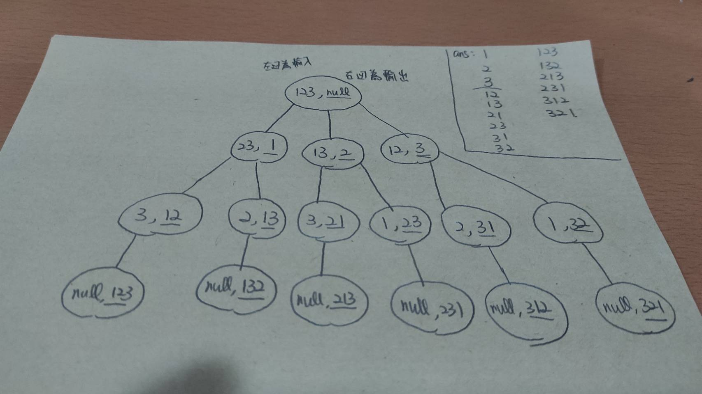

# 12218-An Industrial Spy

給定一個不超過7位數的數，求其排列組合後數字為質數的各數

		ex: 17 = "1" "7" "17" 輸出3個
		999999 = ""	輸出0個

## solution:

利用遞迴暴力排出所有的排列，再找出哪幾個是質數

如果讓每個排列出來的數都用mod去檢查是不是質數，時間複雜度會非常高，這邊使用了一個技巧，

先把範圍內所有質數都列出來做成一個表，最後只要用index去確認是不是質數就可以節省很多時間。


### 質數表:

>列出所有正整數。從 2 開始，刪掉 2 的倍數。找下一個未被刪掉的數字，找到 3 ，刪掉 3 的倍數。找下一個未被刪掉的數字，找到 5 ，刪掉 5 的倍數。如此不斷下去，就能刪掉所有合數，找到所有質數。


```c++
void getprime() // prime table(0到9999999)
{
    for (int i = 0 ; i <= 9999999 ; i++)
    {
        prime[i] = true;  //先把所有質數預設為true(是質數)
    }
    prime[0] = false; prime[1] = false;  // 0 and 1 不是質數
    for (int i = 2 ; i <= 9999999 ; i++) // 從2開始找
    {
        if (prime[i]) //如果i是質數
        {
            for (int j = i + i; j <= 9999999; j += i)
            {
                prime[j] = false;  //把所有i的倍數都改成false(不是質數)
            }
        }
    }
}
```

### 排列組合:

```c++
void perm(string s1, string s2) 
{
    if (s2 != "") output(s2) //s2不是空的就輸出
    for (int i = 0 ; i < s1.length() ; i++)
    {       
        string s3 = s1;
        perm(s3.erase(i,1), s2 + s1[i]); // 取出s1的第i個字元給s2
    }
}

```

這題的排列組合有點特別，除了n個數字做排列之外,每個個別的數字都是輸出,以123為例:

| 輸入  | 動作   |  輸出 |下個輸入  |
| ------| -----:| :----:|:----:    |
| 123   | 取出1 |   1   |    23    |
| 23    | 取出2 |   12  |      3   |
| 3     |  取出3|  123  |  NULL    |

>當輸入為NULL，也就是都拿完之後 ,就會回到上個值, 準備要去拿上一回合沒拿到的數

| 輸入  | 動作   |  輸出 |下個輸入  |
| ------| -----:| :----:|:----:    |
| NULL  | RETURN |   NULL  |   3   |
| 3    | RETURN |   NULL  |    23  |

>因為除了3之外沒有其他可以拿的數(都拿過了),所以回到上個值

| 輸入  | 動作   |  輸出 |下個輸入  |
| ------| -----:| :----:|:----:    |
| 23   |  取出3 |  13  |  2    |
| 2  | 取出2 |   132   |    NULL    |

>這邊也是,因為沒東西可以拿了(NULL),所以回到上個值

| 輸入  | 動作   |  輸出 |下個輸入  |
| ------| -----:| :----:|:----:    |
| NULL  | RETURN |   NULL  |   2   |
| 2    | RETURN |   NULL  |    23  |

>因為除了2之外沒有其他可以拿的數(都拿過了),所以回到上個值

| 輸入  | 動作   |  輸出 |下個輸入  |
| ------| -----:| :----:|:----:    |
| 23  | RETURN |   NULL  |   123   |

>因為2跟3都拿過了,所以回到上個值

**到這邊之後就是第二回合,就是1當頭的已經排列好了,接下來換2**

| 輸入  | 動作   |  輸出 |下個輸入  |
| ------| -----:| :----:|:----:    |
| 123    | 取出2 |   2  |    13  |
| 13   |  取出1 |  21  |  3      |
| 3  |  取出3 |   213  |  NULL   |

>以此類推,簡單來說就是從s字串中取出一個數給s1做排列,實際的遞迴如下樹狀圖




